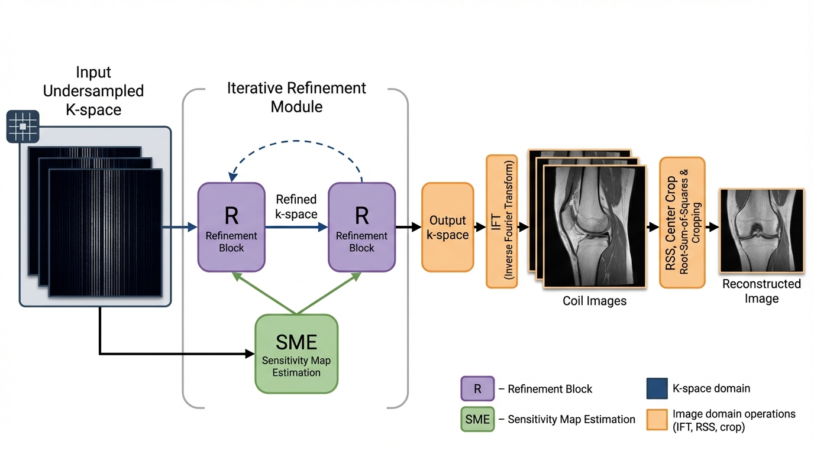

# Accelerated MRI Reconstruction with VarNet + Wavelet CNN

## Introduction
This project implements accelerated MRI reconstruction from under-sampled k-space using a Variational Network (VarNet) backbone with a Wavelet CNN (MWCNN/WCNN) regularizer. The goal is to recover high-quality MR images while reducing scan time, validated on fastMRI-style knee and brain datasets.

## Dataset
The code expects fastMRI-style HDF5 files and CSV manifests listing `file_name` and `acquisition`.
See `data/README.md` for the expected layout and file naming.

| Dataset | Anatomy | Modality | Train Vol. | Validation Vol. |
| --- | --- | --- | --- | --- |
| fastMRI [14] | Knee (Single-coil) | PD | 484 | 100 |
| fastMRI [14] | Knee (Single-coil) | PDFS | 489 | 99 |
| fastMRI [14] | Knee (Multi-coil) | PD | 158 | 29 |
| fastMRI [14] | Knee (Multi-coil) | PDFS | 170 | 31 |
| M4Raw [15] | Brain (Multi-coil) | AXT1 | 308 | 76 |
| M4Raw [15] | Brain (Multi-coil) | AX FLAIR | 207 | 49 |
| M4Raw [15] | Brain (Multi-coil) | AXT2 | 304 | 80 |

## Model
The reconstruction pipeline uses cascaded data consistency with a learned wavelet-domain regularizer.



## Metric
This project reports PSNR and SSIM on reconstructed images.

### PSNR
The peak signal-to-noise ratio (PSNR) is a ratio between the maximum possible power of a signal and the power of the distorting noise that affects its representation. As signals have a wide range of power, PSNR is measured in a logarithmic scale (dB).

$$
\mathrm{PSNR}(y', y) = 10 \times \log_{10}\left[\frac{\max(y)^2}{\mathrm{MSE}(y', y)}\right]
$$

### SSIM
Mean Squared Error (MSE) may be easy to implement, but it does not provide information about perceived similarity. The Structural Similarity Index Measure (SSIM) is a full-reference metric; image quality is computed against a distortion-free reference image (the ground truth).

$$
\mathrm{SSIM}(x, y) = \frac{(2\mu_x \mu_y + c_1)(2\sigma_{xy} + c_2)}{(\mu_x^2 + \mu_y^2 + c_1)(\sigma_x^2 + \sigma_y^2 + c_2)}
$$

where

$$
\begin{array}{rl}
\mu_x & = \text{average of } x \\
\mu_y & = \text{average of } y \\
\sigma_x & = \text{variance of } x \\
\sigma_y & = \text{variance of } y \\
c_1, c_2 & \text{ are two variables to stabilize the division.}
\end{array}
$$

## Result (Knee Multi-Coil)
Example reconstruction result on knee multi-coil data.


## Folder Architecture
- `src/models/`: VarNet, WCNN, and wavelet blocks
- `src/datasets/`: fastMRI-style dataset loading
- `src/losses/`, `src/metrics/`: SSIM/PSNR and training losses
- `configs/`: dataset, model, and training configs
- `scripts/`: training/validation scripts
- `figures/`: model diagrams and result images
- `notebooks/`: original experiments and exports
- `paper/`, `pdfs/`: thesis and related documents

## Training
Knee (default configs):
```bash
scripts/train.sh
```

Brain (M4Raw configs):
```bash
python -m src.train \
  --dataset-config configs/dataset_brain.yaml \
  --model-config configs/model.yaml \
  --train-config configs/train_brain.yaml
```

## Evaluation
Validation:
```bash
scripts/validate.sh /path/to/checkpoint.ckpt
```

Testing:
```bash
python -m src.test \
  --dataset-config configs/dataset.yaml \
  --model-config configs/model.yaml \
  --train-config configs/train.yaml \
  --checkpoint /path/to/checkpoint.ckpt
```

## Citation
```bibtex
@thesis{your_name_2026,
  title     = {Variational Network with Wavelet-based UNET in Accelerated MRI Reconstruction from Under Sampled K-space Data},
  author    = {Yasir Arafat Prodhan, Dr. Shaikh Anowarul Fattah},
  year      = {2026},
  school    = {Bangladesh University of Engineering & Technology}
}
```
